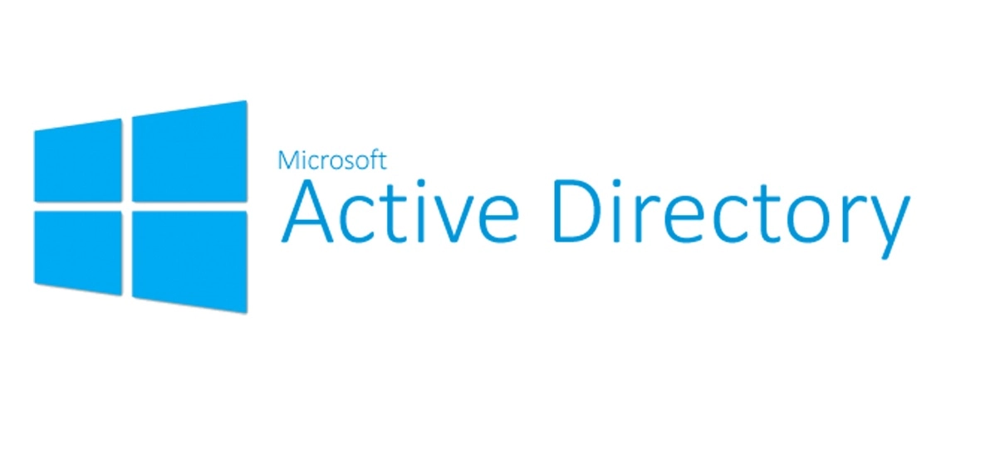
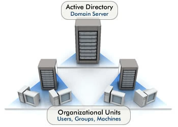
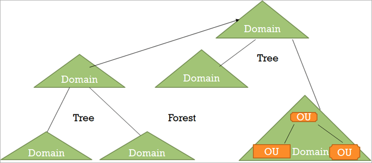
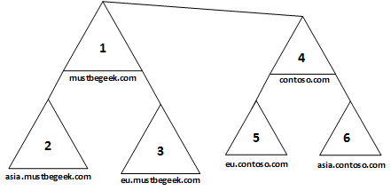
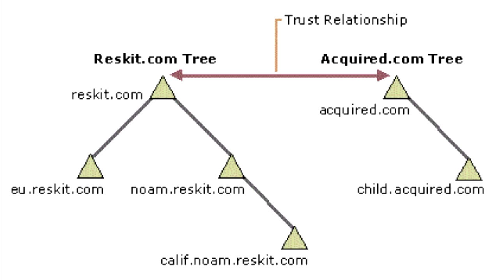
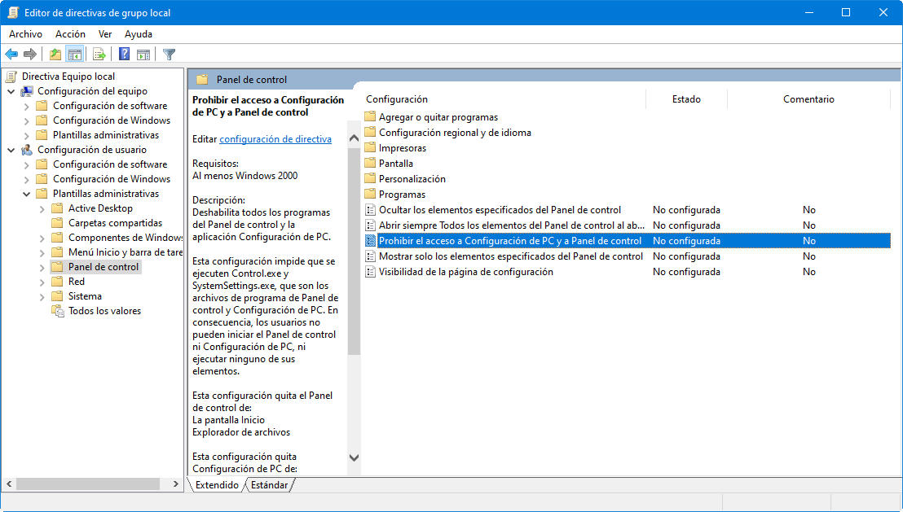
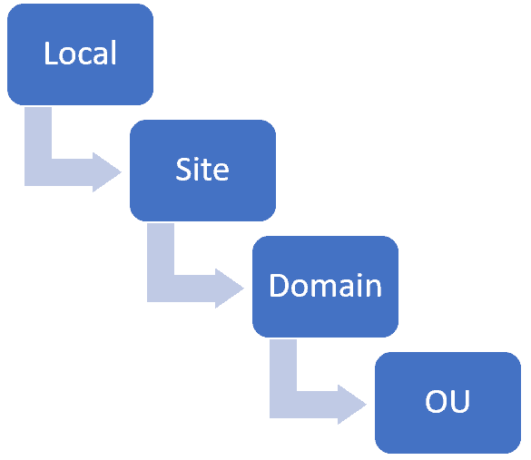

# Entornos Windows

## Active Directory

Empresas de todos los tamaños en todo el mundo utilizan Active Directory para administrar los permisos y controlar el acceso a los recursos críticos de la red empresarial. Pero, ¿qué es exactamente y cómo afecta al negocio?

### ¿Qué es Active Directory?

Active Directory (AD) es un servicio de directorio que se ejecuta en Microsoft Windows Server. Un directorio es una estructura jerárquica que almacena información sobre los objetos en la red. 

La función principal de Active Directory (AD) es proporcionar un servicio de directorio centralizado para la administración y autenticación de usuarios y recursos en una red. Desarrollado por Microsoft, Active Directory permite gestionar información y controlar el acceso a recursos dentro de una red empresarial

Active Directory usa un almacén de datos estructurado como base para una organización jerárquica lógica de la información del directorio.

Sus funciones principales son:

1. **Gestión de identidades y autenticación:** Active Directory almacena información sobre los usuarios, como nombres, contraseñas y permisos, facilitando la autenticación de los usuarios cuando inician sesión en una red. Utiliza el protocolo Kerberos para garantizar una autenticación segura.
2. **Control de acceso:** Permite a los administradores definir quién tiene acceso a recursos específicos, como archivos, impresoras, o aplicaciones. Las políticas de grupo (Group Policy) en AD permiten administrar configuraciones de seguridad y restricciones a nivel de usuario o de equipo.
3. **Centralización:** AD permite una administración centralizada de toda la red. Desde un solo punto (el Controlador de Dominio), los administradores pueden gestionar cuentas de usuarios, permisos, y políticas de seguridad en todos los dispositivos conectados al dominio.
4. **Organización jerárquica de objetos:** Active Directory organiza los recursos de la red, como usuarios, grupos, computadoras y dispositivos, en una estructura jerárquica. Esta estructura incluye dominios, árboles y bosques, lo que facilita el acceso y la gestión de los recursos.
5. **Escalabilidad:** Es adecuado tanto para pequeñas redes como para grandes entornos empresariales con múltiples sitios y miles de usuarios. La replicación de AD permite mantener sincronizados los controladores de dominio en diferentes ubicaciones.
6. **Autorización y seguridad:** Además de la autenticación, AD también controla la autorización para determinar qué recursos pueden usar los usuarios una vez autenticados. AD refuerza la seguridad mediante políticas de contraseñas y otros métodos de autenticación avanzada.

!!!Tip "Definición"

     El directorio activo o Active Directory (AD) es una manera de organizar y gestionar todos los elementos de una red informática: ordenadores, grupos, usuarios, dominios, políticas de seguridad, y cualquier tipo de objetos definidos para el usuario. 

AD simplifica la vida de los administradores y usuarios finales al tiempo que mejora la seguridad de las organizaciones a través de la función políticas de grupo de AD. 

Los usuarios pueden autenticarse una vez y luego acceder sin problemas a cualquier recurso en el dominio para el que están autorizados (inicio de sesión único). 

Además, los archivos se almacenan en un repositorio central donde se pueden compartir con otros usuarios para facilitar la colaboración y los equipos de TI pueden  respaldarlos adecuadamente para garantizar la continuidad del negocio.

{: style="height:400px;width:800px"}

### Antes de nada, ¿qué es un dominio?

Un dominio representa una agrupación lógica de un conjunto ordenadores, usuarios y servicios conectados en una red los cuales comparten una base de datos de Active Directory. La base de base de datos es probablemente el elemento más importante en un AD (Active Directory) y es gestionada por los servidores centrales del dominio, también conocidos como Domain Controllers. 

Un dominio básicamente es una etiqueta que típicamente representa un nombre DNS, el cual en algunas organizaciones es el mismo que su sitio web, pero no tiene porque ser así en todos los casos y es posible que la organización prefiera utilizar otro nombre de dominio que será al que se unirán las estaciones de trabajo.

### ¿Qué son los Domain Services (sevicios de dominio) de Active Directory?

Los servicios de dominio de Active Directory (AD DS) son un componente central de Active Directory y proporcionan el mecanismo principal para autenticar a los usuarios y determinar a qué recursos de red pueden acceder. Los servidores que ejecutan AD DS se denominan controladores de dominio (DC). Éstos son sistemas basados en Windows Server que pueden acceder y manipular la base de datos del AD. Cada dominio tiene como mínimo un controlador, por lo que si por ejemplo, un departamento o unidad de negocio crece más de lo esperado, es posible instalar más controladores de dominio dedicados a procesar las solicitudes de las estaciones de trabajo en ese departamento. También es posible crear subdominios para que los usuarios puedan acceder a los recursos en otros subdominios que hagan parte del mismo Forest.

Las organizaciones normalmente tienen varios DC y cada uno tiene una copia del directorio para todo el dominio. Los cambios realizados en el directorio en un controlador de dominio, como la actualización de la contraseña o la eliminación de una cuenta de usuario, se replican en los otros controladores de dominio para que todos estén actualizados. 

AD DS también proporciona características adicionales como inicio de sesión único (SSO) mediante Kerberos, certificados de seguridad, LDAP (protocolo ligero de acceso a directorios) y administración de derechos de acceso.

### La estructura jerárquica de los servicios de dominio de Active Directory

Los dominios en AD son muy flexibles y permiten crear una infraestructura completa y bien organizada. Partiendo de un dominio raíz, es posible crear subdominios que representen la disposición física y/o lógica de las estaciones de trabajo. Esto significa que se puede crear un subdominio para el departamento de ventas, IT, marketing, etc. También se podría crear subdominios para las oficinas que se encuentran distribuidas en diferentes ubicaciones geográficas. Evidentemente, se trata de decisiones de diseño a la hora de configurar la red.

AD DS organiza los datos en una estructura jerárquica que consta de dominios, árboles y bosques, como se detalla a continuación.

+ ^^**Dominios:**^^ un dominio representa un grupo de objetos, como usuarios, grupos y dispositivos, que comparten la misma base de datos de AD. Puedes pensar en un dominio como una rama en un árbol. Un dominio tiene la misma estructura que los dominios y subdominios estándar, por ejemplo, tudominio.com y ventas.tudominio.com.
  
    Un dominio representa un límite de administración. Los objetos de un dominio determinado se almacenan en una única base de datos y se pueden administrar juntos.

+ ^^**Árboles:**^^ un árbol es uno o más dominios agrupados en una jerarquía lógica. Dado que los dominios de un árbol están relacionados, se dice que "confían" entre sí.

+ ^^**Bosque:**^^ un bosque es el nivel más alto de organización dentro de AD y contiene un grupo de árboles. Los árboles de un bosque también pueden confiar entre sí y también compartirán esquemas de directorio, catálogos, información de aplicaciones y configuraciones de dominio.
  
    El bosque define los límites de seguridad y los confines de confianza en una red. Todos los objetos dentro de un bosque comparten una configuración de seguridad común. Los objetos de diferentes bosques no pueden interactuar entre sí a menos que los administradores de cada bosque creen una relación de confianza entre ellos

+ ^^**Unidades organizativas:**^^ una unidad organizativa permite, como su propio nombre indica, organizar y agrupar usuarios, grupos, equipos y otras unidades organizativas. Son contenedores dentro de un dominio que permiten organizar de manera lógica los objetos (usuarios, equipos, grupos) para una administración más fácil

    Las OUs se pueden anidar, lo que facilita la creación de una estructura jerárquica que refleja la organización real (por ejemplo, departamentos o ubicaciones geográficas).

+ ^^**Contenedores:**^^ un contenedor es similar a una unidad organizativa; sin embargo, a diferencia de una unidad organizativa, no es posible vincular un objeto de directiva de grupo (GPO) a un contenedor genérico de Active Directory.

{: style="height:275px;width:500px" align=left }

{: style="height:275px;width:450px" align=right }

{: style="height:250px;width:450px" align=left }

{: style="height:250px;width:450px" alignt=right}

### Otros servicios de Active Directory

Además de los servicios de dominio de Active Directory, hay varios otros servicios críticos que proporciona AD. Algunos de esos servicios se enumeran a continuación:

**Servicios de directorio ligeros:** AD LDS es un servicio de directorio del Protocolo ligero de acceso a directorios (LDAP). Proporciona solo un subconjunto de las funciones de AD DS, lo que lo hace más versátil en términos de dónde se puede ejecutar. Por ejemplo, se puede ejecutar como un servicio de directorio independiente sin necesidad de integrarse con una implementación completa de Active Directory.
Se utiliza para aplicaciones que necesitan un servicio de directorio pero que no requieren el entorno completo de un dominio, como aplicaciones de autenticación de usuarios para sistemas o aplicaciones específicas.

**Servicios de certificados:** AD CS gestiona la infraestructura de claves públicas (PKI), lo que permite emitir, gestionar y validar certificados digitales. Estos certificados pueden utilizarse para la autenticación de usuarios, dispositivos y aplicaciones, así como para cifrado de datos y comunicaciones.

**Servicios de federación de Active Directory:** ADFS es una solución de inicio de sesión único (SSO) para AD que permite a los empleados acceder a múltiples aplicaciones con un único conjunto de credenciales, lo que simplifica la experiencia del usuario.

**Servicios de administración de derechos:** AD RMS es un servicio que proporciona protección de la información mediante la aplicación de políticas de derechos digitales (DRM) a documentos y correos electrónicos. Esto garantiza que solo los usuarios autorizados puedan ver o editar la información protegida.
AD RMS se utiliza para proteger la propiedad intelectual y datos sensibles en archivos, correos electrónicos y documentos, al limitar quién puede acceder a, editar o reenviar esa información, incluso después de ser descargada o copiada.

El servidor que aloja AD DS se denomina **controlador de dominio (DC)**. También se puede usar un controlador de dominio para autenticarse con otros productos de MS, como Exchange Server, SharePoint Server, SQL Server, File Server u otros.

| **Servicio**                         | **Función**                                               | **Uso**                                           |
|--------------------------------------|-----------------------------------------------------------|---------------------------------------------------|
| **AD DS** (Domain Services)          | Autenticación y gestión de identidades                    | Administrar usuarios y recursos en redes empresariales |
| **AD LDS** (Lightweight Directory) | Versión ligera de AD, usa LDAP para aplicaciones          | Aplicaciones que requieren un directorio, sin necesidad de dominio |
| **AD CS** (Certificate Services)   | Infraestructura de claves públicas y certificados         | Autenticación con certificados, SSL/TLS, cifrado |
| **AD FS** (Federation Services)    | Federación de identidades, Single Sign-On (SSO)           | Integración con aplicaciones externas, SSO entre dominios |
| **AD RMS** (Rights Management)     | Protección de datos y derechos digitales (DRM)            | Control de acceso y protección de documentos y correos electrónicos |
| **LDAP**                             | Protocolo para acceder y gestionar servicios de directorio | Autenticación y gestión de recursos desde aplicaciones |
| **Replication Services**             | Replicación de datos entre controladores de dominio       | Consistencia de la base de datos de AD en todas las ubicaciones |

!!!Danger "Atención"
    El controlador de dominio, hablando de ciberseguridad en entornos Windows, ***es la joya de la corona***. 
    
    Bien sea realizando un pentest legal, bien sea un ataque malintencionado por parte de ciberdelincuentes, el fin último siempre será llegar a ser administrador del Controlador de Dominio (DC). 

    Por ello es tremendamente importante conocer su complejo funcionamiento y saber fortificarlo en la medida de lo posible para protegernos frente a los ataques más comunes.

### Usuarios de AD

Entre otras cosas, Active Directory gestiona los usuarios del entorno tratándolos como un tipo de objeto especial que se almacena en la base de datos central. A continuación se listan algunas cuestiones importantes a tener en cuenta sobre los usuarios de un dominio.

+ Aunque el nombre de usuario sirve para identificarle, el SID (Security Identifier) también puede ser utilizado para dicho fin. El SID es la combinación del Domain SID y el RID (Relative Identifier). Algunas herramientas enseñan el SID en lugar del nombre de usuario, por ese motivo es importante saber esto. 
  
    El SID asegura la correcta aplicación de permisos y controles de acceso en entornos Windows. Es fundamental para la administración de la seguridad y la gestión de identidades en redes corporativas.

+ Los user secrets son elementos utilizados por el Domain Controller para realizar el proceso de autenticación. Las contraseñas no se guardan en texto plano, pero los user secrets derivados de ellas sí, los cuales son Hashes NT y claves Kerberos.

+ **Los hashes LM y NT son almacenados en dos sitios: La SAM (Security Account Manager) de Windows y (en entornos de dominio) en la base de datos del AD, la cual por defecto se encuentra disponible en los DC en la ruta C:\Windows\NTDS\ntds.dit.**

+ Aunque los hashes NT no son contraseñas, se pueden utilizar en algunos casos para ataques del tipo Pass-The-Hash/Overpass-The-Hash

+ Los ordenadores registrados en un AD también están representados por una cuenta de usuario, la cual es el nombre de la estación de trabajo con un “$” al final.

+ Probablemente las cuentas de usuario más importantes son Administrator y krbtgt. La primera tiene privilegios altos en el sistema y la segunda permite el cifrado de los tickets TGT, lo que significa que si un atacante compromete dicha cuenta podrá crear este tipo de tickets sin problema. A esta técnica se le conoce como *Golden Ticket.*

### Base de datos NTDS

La base de datos de un AD contiene todos los objetos que se encuentran disponibles en el entorno y se comparte/sincroniza con todos los DC. Por defecto, se encuentra ubicada en el fichero C:\Windows\NTDS\ntds.dit de cada DC. Por otro lado, la NTDS se caracteriza por dos cosas:

+ Es una base de datos distribuida.
+ Cuenta con una estructura basada en objetos y jerarquías de clases.

El archivo NTDS.dit es una base de datos que almacena datos de Active Directory, incluida información sobre objetos de usuario, grupos y pertenencia a grupos. Incluye los hashes NTLM  de las contraseñas para todos los usuarios y computadores.

En entornos con múltiples controladores de dominio, NTDS.dit permite la replicación de datos entre estos controladores, asegurando que todos tengan copias actualizadas de la base de datos de Active Directory.

Este archivo utiliza un formato de base de datos basado en Extensible Storage Engine (ESE), que es el mismo motor de base de datos utilizado en otras aplicaciones de Microsoft, como Microsoft Exchange.

Al extraer estos hashes, es posible utilizar herramientas como Mimikatz para realizar ataques de pass-the-hash o herramientas como Hashcat para descifrar estas contraseñas. La extracción y el descifrado de estas contraseñas se pueden realizar sin conexión, por lo que serán indetectables. Una vez que un atacante ha extraído estos hashes, puede actuar como cualquier usuario, incluidos los administradores de dominio.

## GPOs

### ¿Qué es una directiva de grupo?

Lo primero es lo primero, ¿qué es una directiva de grupo? La directiva de grupo es una característica de Windows que facilita una amplia variedad de configuraciones avanzadas que los administradores de sistemas pueden usar para controlar el entorno de trabajo de los usuarios y las cuentas de usuario en Active Directory. 

**Básicamente, proporciona un lugar centralizado para que los administradores administren y configuren los sistemas operativos, las aplicaciones y los ajustes de los usuarios.**

Las políticas de grupo, cuando se usan correctamente, permiten aumentar la seguridad de las computadoras de los usuarios y ayudarlo a defenderse tanto de las amenazas internas como de los ataques externos.

### ¿Qué es un objeto de directiva de grupo o *Group Policy Object* (GPO)?

Un objeto de directiva de grupo (GPO) es un grupo de configuraciones que se crean mediante el Editor de directivas de grupo de Microsoft Management Console (MMC). Los GPO se pueden asociar con uno o varios contenedores de Active Directory, incluidos sitios, dominios o unidades organizativas (OU). MMC permite a los usuarios crear GPO que definen políticas basadas en el registro, opciones de seguridad, instalación de software y mucho más.

Active Directory aplica los GPO en el mismo orden lógico; políticas locales, políticas de sitio, políticas de dominio y políticas de OU.

!!!Note "Nota"
    Nota: Los GPO que están en unidades organizativas anidadas funcionan primero desde la unidad organizativa más cercana a la raíz y desde allí hacia afuera.

### Ejemplos de GPO

Los Objetos de directiva de grupo o GPO se pueden usar de varias formas para que beneficien a la seguridad. A continuación se muestran algunos ejemplos concretos:

* Una GPO podría usarse para determinar la página de inicio que un usuario ve cuando inicia su navegador de Internet después de iniciar sesión en el dominio.

* Los administradores pueden usar GPO para definir qué impresoras conectadas a la red aparecen en la lista de impresoras disponibles después de que un usuario en una OU de Active Directory específica inicia sesión en el dominio.

* Los administradores también pueden usar GPO para modificar una serie de protocolos y prácticas de seguridad, como restringir las opciones de conexión a Internet, los programas e incluso el tiempo de pantalla inactiva.

* Restringir el acceso al panel de control y Configuración

     

* Bloquear acceso al símbolo del sistema

* Impedir la instalación de software 

* Desactivar las actualizaciones automáticas de controladores.
    
     

### ¿Cómo se procesan los objetos de directiva de grupo?

El orden en el que se procesan los GPO afecta la configuración que se aplica al equipo y al usuario. 

El orden en que se procesan los GPO se conoce como LSDOU, que significa local, sitio(una especie de subred en nuestro dominio), dominio, unidad organizativa. La política de la computadora local es la primera en ser procesada, seguida del nivel del sitio a las políticas de AD de dominio, y finalmente en las unidades de la organización. Si hay políticas en conflicto en LSDOU, las últimas políticas aplicadas ganan.

{: style="height:300px;width:400px"}

### Beneficios de las GPOs

Los beneficios de la política de grupo no se limitan únicamente a la seguridad, hay una serie de otras ventajas que vale la pena mencionar.

* ^^**Política de contraseñas:**^^ muchas empresas tienen políticas de contraseñas demasiado laxas, y muchos usuarios a menudo tienen contraseñas configuradas para que nunca caduquen. 
    
    Las contraseñas que no se rotan regularmente, son demasiado simples o usan palabras comunes corren el riesgo de ser vulneradas por fuerza bruta. Los GPO se pueden utilizar para establecer la longitud, la complejidad y otros requisitos de la contraseña.

* ^^**Gestión de sistemas:**^^ los GPO se pueden utilizar para simplificar tareas sencillas y repetitivas, ahorrando así mucho tiempo. Pueden ahorrar horas y horas de configuración del entorno de nuevos usuarios y equipos que se unen al dominio mediante el uso de GPOs para aplicar una configuración universal y estándar.

* ^^**Verificación de estado:**^^ los GPO se pueden usar para implementar actualizaciones de software y parches del sistema para garantizar que su entorno esté en buen estado y actualizado contra las últimas amenazas de seguridad.

### Limitaciones de las GPOs

Estaríamos faltando a la verdad si dijeramos que los GPO son la fórmula mágica para mantener los datos seguros. Hay una serie de limitaciones que se deben conocer.

En primer lugar, el editor de GPO no es la consola más fácil de usar, más bien es un tanto adusto. Un conocimiento profundo de PowerShell ayudará a que sea más fácil realizar todas las actualizaciones de GPO, lo cual complica más la cosa si cabe.

Las actualizaciones de GPO, se realizan aleatoriamente cada 90 a 120 minutos cada vez que se reinicia la computadora.Puede específicarse una tasa de actualización desde 0 minutos hasta 45 días. Sin embargo, si se especifican 0 minutos, entonces, de forma predeterminada, las GPO intentarán actualizarse cada 7 segundos, lo que probablemente inunde la red de tráfico.

Los GPO tampoco son inmunes a los ciberataques. Si un atacante quisiera cambiar las GPO locales en una computadora para moverse lateralmente a través de la red, sería muy difícil detectarlo sin una solución de auditoría y monitoreo de políticas de grupo implementada.

<!-- ## Actualizaciones del SO
## Manejo de credenciales
## Escalada de privilegios
## EDR -->